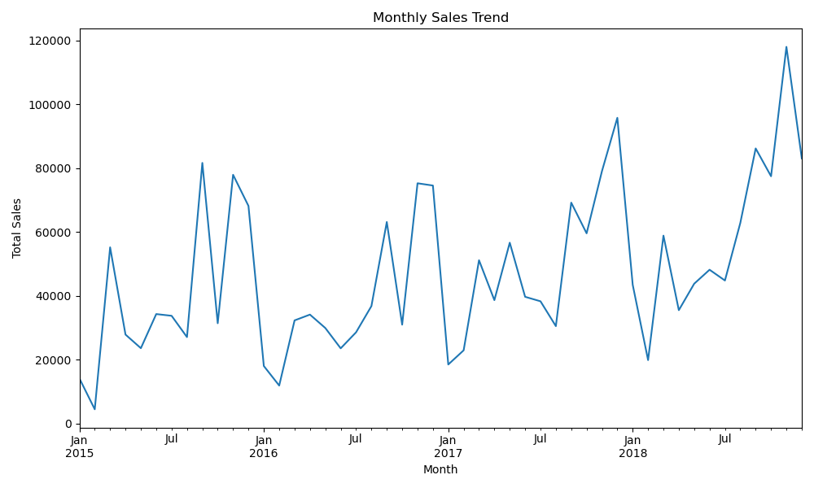
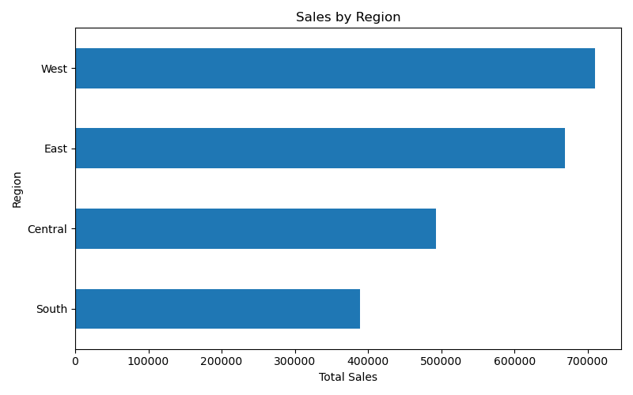
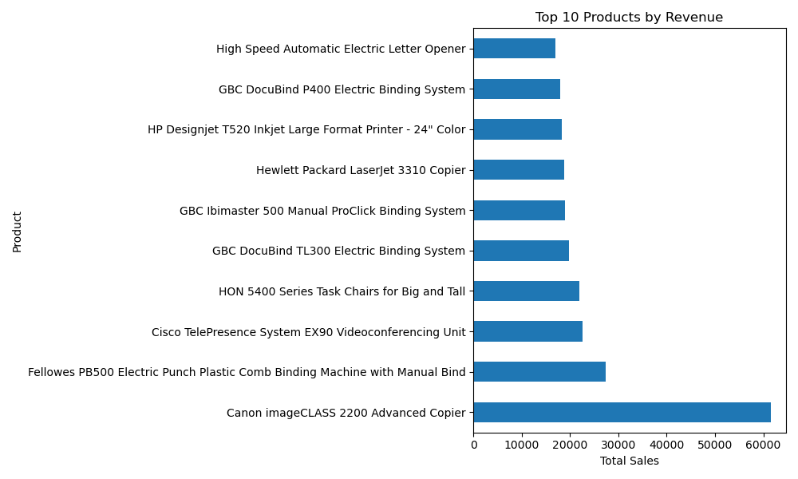

# Retail Sales Performance Analysis

## Project Overview

This project analyzes retail sales data to uncover patterns in customer behavior, product performance, and regional sales trends. The goal is to identify key drivers of revenue and provide insights that could support business decision-making.

## Dataset

The dataset contains approximately 9,800 retail transactions with information about:

- Order date
- Customer segment
- Product category
- Product name
- Region and city
- Sales amount

## Tools Used

- Python
- Pandas
- Matplotlib
- Jupyter Notebook

## Business Questions Explored

1. How do sales change over time?
2. Which regions generate the most revenue?
3. Which products generate the most revenue?

## Key Insights

- The **West region generates the highest revenue**, followed closely by the East region.
- **Technology products drive the most sales**, outperforming Furniture and Office Supplies.
- A small group of **high-value products contributes significantly to total revenue**.

## Visualizations

### Monthly Sales Trend

### Sales by Region

### Top Products by Revenue

## Project Structure

retail_sales_analysis/
│
├── sales_data.csv
├── sales_analysis.ipynb
├── visuals/
│ ├── monthly_sales_trend.png
│ ├── sales_by_region.png
│ └── top_products_chart.png

## Future Improvements

- Build an interactive dashboard in Tableau
- Perform customer segmentation analysis
- Explore profitability trends
